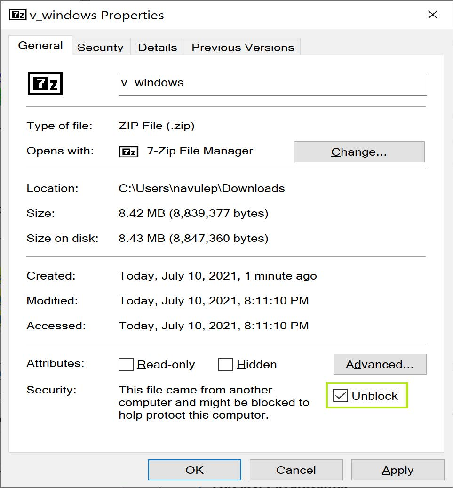

# 第2章 安装V编程

V编程语言支持各种操作系统(OS)，例如Windows、Linux(包括Windows子系统(WSL))、macOS、BSD、Solaris、Android和Raspbian。 在本章中，我们将重点介绍如何在开发活动中使用最常用的操作系统(例如Windows和Ubuntu)上安装V编程语言。 此外，我们还将了解如何在Windows中将V添加到环境变量。 对于Ubuntu操作系统，我们将介绍如何通过创建符号链接使V全局可访问。 这将使我们能够使用命令行解释器(CLI)从操作系统中的任何目录访问V。

在本章中，我们将涵盖以下主题：

- 在Windows操作系统中安装V

- 在Windows操作系统中将V添加到环境变量

- 在Linux操作系统(Ubuntu)上安装V

- 将符号链接V在Ubuntu中使得V全局可访问

### 技术要求

本章需要以下要求：

- 访问正在安装的操作系统的命令行终端

- 管理员权限(可选)

- 可选GCC编译器，这在操作系统特定的安装步骤中提及。

## 在Windows操作系统上安装V

Windows是多数开发者使用的最受欢迎的操作系统，V也支持它。我们将在Windows 10操作系统上安装V编程语言。有两种方式可以在Windows 10操作系统上安装V：

- 从便携式二进制文件安装V(可以从官方V网站 https://vlang.io/ 下载)。
- 从最新的源代码安装V(可以从V的官方GitHub存储库 https://github.com/vlang/v克隆)。

让我们更详细地看一下这两种安装方法。如果您在Windows操作系统上遵循其中任何一种安装方法，则可以跳过备用方法。

### 方法1-在Windows操作系统上从便携式二进制文件安装V

通常，便携式安装使您可以将打包为存档的软件简单地提取到所选位置，而不实际修改任何系统行为或注册表设置。在此方法中，我们将直接下载V的便携式二进制文件，并将其放置在我们选择的位置：

1.从 https://github.com/vlang/v/releases/download/v0.1.10/mingw-w64-install.exe 下载并安装GCC编译器。

或者，您可以从官方网站 http://mingw-w64.org/doku.php 下载GCC。

2.从官方V网站 https://vlang.io/ 下载便携式二进制文件。下载便携式二进制文件的URL是 https://github.com/vlang/v/releases/latest/download/v_windows.zip 。

3.下载完成后，在默认下载目录中找到名为`v_windows.zip`的存档。右键单击存档，然后单击属性。找到并选择取消勾选复选框，然后单击确定，如下所示：


图2.1-v_windows属性显示取消勾选存档

### 注意

您可能会看到或不会看到v_windows存档的取消勾选选项，具体取决于Windows设置。如果Windows阻止从Internet下载的文件的访问，则会显示取消勾选选项。另一个可能的原因是您下载的存档是在Windows之外的操作系统上创建的。

4.将`v_windows.zip`提取到C驱动器。如果您希望将其安装在任何其他目录中，则可以通过将其提取到所选目录来实现。假设您已将其提取到C：；您将在C：\ v位置找到保存所有二进制文件和可执行文件的v目录。

5.打开命令提示符并运行以下命令以检查v是否已正确安装：
```
cd c:\v

v version
```
6.您应该能够查看显示已在PC上下载和安装的V版本的输出。它将显示如下：
```
V 0.2.2 a108827
```
从v版本命令的输出中，V 0.2.2部分表示V的版本，格式为`major.minor.patch`。除了版本信息之外，您还可以选择从官方V GitHub存储库中看到提交ID(在本例中为a108827)。由于V不断更新，您可能会观察到不同的提交ID。

### 方法2-在Windows操作系统上从源代码安装V

只要V处于开发状态，建议始终使用来自官方V GitHub存储库 https://github.com/vlang/v 的最新可用V源。确保从 https://git-scm.com/download/win 下载并安装Windows的开源软件Git。执行以下步骤以从源代码安装V：

1.在Windows中打开命令行终端，并通过运行以下命令克隆最新源：
```
cd C:\

git clone https://github.com/vlang/v
```
2.等待git将官方V存储库克隆到您的PC。下载后，让我们通过运行以下命令移动到V目录：
```
cd v
```
3.现在，是时候编译源代码以生成名为v.exe的V可执行文件了。要生成v.exe，我们需要从命令行终端中的v目录运行名为make.bat的批处理脚本：
```
make.bat
```
请注意，make.bat命令的输出在命令行控制台上生成以下日志：
```
Bootstraping TCC...

 > TCC not found

 > Downloading TCC from https://github.com/vlang/tccbin

Cloning vc...

 > Cloning from remote https://github.com/vlang/vc

Building V...

 > Clang not found

 > GCC not found

 > Attempting to build v_win.c with TCC

 > Compiling with .\v.exe self

 > V built successfully

 > To add V to your PATH, run `.\v.exe symlink`.

V version: V 0.2.2 a108827
```


请注意，这次 V 版本指示相同的版本，但具有不同的 git 提交 ID。您可以将其与 V 的官方 GitHub 存储库上的最新提交 ID 匹配。您可能会看到不同的提交 ID，因为 V 在不断开发中。


通过运行 `make.bat` 命令，会在 V 目录中生成一个名为 `v.exe` 的新可执行文件。从终端，您可以运行 `.\v.exe symlink`。这将添加 V 到环境变量。在这种情况下，您可以跳过以下部分，并继续阅读从使用 REPL 访问 V 编程部分开始的内容。在下一节中，我将详细解释手动将 V 添加到环境变量的过程。


## 将 V 添加到 Windows操作系统 的环境变量


要从操作系统 中的任何目录访问 V，我们需要将 `v.exe` 所在的 V 目录路径添加到系统环境变量中。在前面的部分中提到的 Windows操作系统 的两种安装方法中，我们已将 V 安装在 `C:\v` 位置。这表示我们已将 V 安装在名为 v 的目录中，该目录位于 C 驱动器中。如果我们检查目录的内容，我们将找到名为 `v.exe` 的 V 可执行文件。因此，我们将添加 `C:\v` 路径到环境变量中。


通过从命令行终端运行以下命令打开环境变量窗口：

```
rundll32 sysdm.cpl,EditEnvironmentVariables
```

您会注意到窗口有两个部分，如下所示：

- 活动用户的用户变量

- 系统变量


如果您希望 V 编程对您系统的所有用户都可用，请编辑 `System variables` 下面的名为 `Path` 的变量。单击 New 按钮。然后，在空行中提供 `v.exe` 所在的路径。在我们的情况下，这将是 `C:\v`。


如果您希望 V 编程仅对登录的用户可用，则编辑 `User variables for the logged-in user` 下面的名为 Path 的变量，并单击 New。然后，在空行中提供 `v.exe` 所在的路径。在我们的情况下，这将是 `C:\v`。


要使这些更改生效，请关闭所有命令行终端并重新打开它们以从 PC 中的任何目录访问 V。


### 使用 REPL 访问 V 编程


REPL 代表读取-评估-打印循环。许多流行的编程语言除了 V，例如 Python、PHP、Rust 和 R 等，都有 REPL。


由于我们已经安装了 V 并将 V 添加到了环境变量窗口，因此我们可以通过从命令行终端运行以下命令来访问 V 的 REPL：

```
v
```

当您成功将命令输入 V 的 REPL 时，应该会看到以下结果：

```
Welcome to the V REPL (for help with V itself, type `exit`, then run `v help`).

V 0.2.2 a108827

Use Ctrl-C or `exit` to exit, or `help` to see other available commands

>>>
```

或者，您可以在命令提示符中键入 `v repl` 并按 `Enter`。请注意三个前向箭头 `>>>`，它们表示接受 V 命令的终端。首先，让我们通过运行以下 V 代码在新行中打印一个字符串：

```
>>> println('Hello World!')


Hello World!
```

注意输出字符串下面打印的输出。请注意，它没有 `Hello World!` 输出字符串之前的三个箭头。


由于 V 程序第一次编译并运行 `println` 语句，因此将在 `%USERPROFILE%/.vmodules` 位置创建一个名为 `.vmodules` 的目录。此文件夹包含来自 V 构建系统的缓存构建工件。


当您进入 V 的 REPL 模式时，运行 `help` 命令将显示所有命令的列表，例如 `list`、`reset`、`clear` 等，如下所示：

```
C:\>v repl

V 0.2.2 a108827

Use Ctrl-C or `exit` to exit, or `help` to see other available commands

>>> help

V 0.2.2 a108827

help                           Displays this information.

list                           Show the program so far.

reset                          Clears the accumulated program, so you can start a fresh.

Ctrl-C, Ctrl-D, exit   Exits the REPL.

clear                          Clears the screen.
```

现在，您已经学会了如何通过REPL访问V编程，让我们学习如何在Linux操作系统上安装V。

## 在Linux操作系统(Ubuntu)上安装V

大多数开发社区都喜欢基于Debian基础设施和架构的开源类Unix操作系统，例如Ubuntu。

Ubuntu是一个基于Debian基础设施和架构的发行版。V支持在Ubuntu操作系统上运行。当我们在Ubuntu操作系统的新实例上安装V时，它将默认下载并安装TCC编译器作为默认的C后端。它是一个非常轻量级的编译器，安装很快。

TCC或Tiny C Compiler是一个轻量级的C编译器。与GNU编译器集合(GCC)相比，TCC在编译时间方面很快。但是，TCC具有诸如结果二进制文件的有限优化和使用TCC编译器构建的可执行文件将更慢等限制。对于生产构建，建议您安装GCC。

在安装V之前，我们需要GCC作为C编译器的先决条件。请注意，在unix-based操作系统上，除了GCC和TCC之外，Clang也是受支持的编译器。但是，让我们继续安装GCC。

打开命令行终端并导航到用户目录。从命令行终端运行以下命令以在Debian / Ubuntu上安装C编译器：
```
sudo apt -y update

sudo apt install -y build-essential
```
一旦我们将GCC安装为build-essential软件包的一部分，我们就可以继续从V的官方GitHub存储库下载源代码。您可以通过运行以下命令来执行此操作：
```
git clone https://github.com/vlang/v
```

下载源代码后，您将找到一个名为v的目录。通过从命令行终端运行以下命令，导航到该目录：
```
cd v
```

现在，您在官方v源代码所在的目录中。现在，我们将通过运行make命令编译源代码，如下所示：
```
make
```

成功运行make命令后，请通过运行以下命令验证安装以检查v的版本：
```
v version
```

输出应如下所示：

```
V 0.2.2 a108827
```

从v版本命令的输出中，V 0.2.2部分表示V的版本，格式为major.minor.patch。除了版本信息之外，您还可以选择从官方V GitHub存储库(https://github.com/vlang/v/) 查看提交ID，本例中为a108827。由于V不断更新，您可能会看到不同的提交ID。

接下来，让我们看看如何使用Symlink V在Ubuntu中全局访问V。

## 使用Symlink V在Ubuntu中使V全局可访问

为了从操作系统中的任何目录访问V可执行文件，最好创建`symlink`。符号链接是一个符号链接，它将允许您从系统中的任何位置访问程序。要创建symlink，请从命令行终端运行以下命令：
```
sudo ./v symlink
```

运行前面的命令后，您将在/usr/local/v位置找到对V可执行文件的引用。导航到您选择的目录并键入v命令。命令行界面将在V的REPL上打印以下消息：
```
Welcome to the V REPL (for help with V itself, type `exit`, then run `v help`).

V 0.2.2 a108827

Use Ctrl-C or `exit` to exit, or `help` to see other available commands

>>>
```

请注意，三个箭头表示终端接受v命令。要开始，请运行以下V代码在新行中打印字符串，如下所示：

```
>>> println('Hello World！')

Hello World！
```

恭喜！您已成功在Ubuntu操作系统上安装了V。我们还创建了一个符号链接，以便您可以从系统中的任何位置访问它。

## 总结

在本章中，我们了解到，由于跨平台兼容性，V支持各种操作系统。 我们还学习了如何在基于Windows和Ubuntu的操作系统上成功安装V。 在成功安装每个操作系统之后，我们还学习了如何通过将V可执行文件的位置添加到环境变量来使V在操作系统中的任何位置都可以访问。

在下一章中，我们将学习V编程的基础知识，包括原始数据类型，数组和映射。 此外，我们还将学习如何编写条件语句和迭代语句以及如何在代码中添加代码注释。
