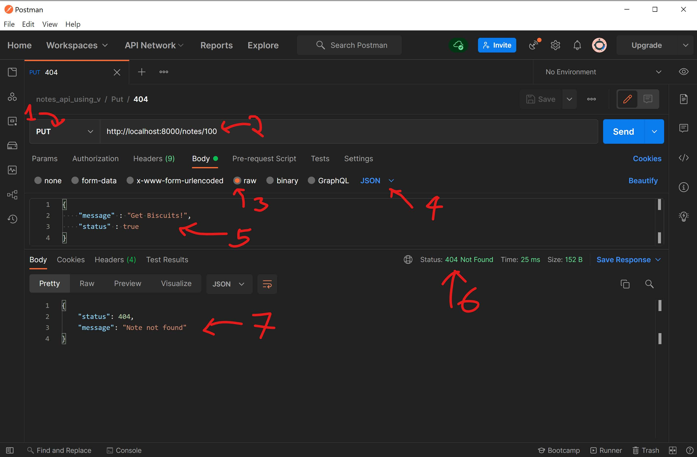

# 第14章 构建微服务

在本章中，我们将学习如何使用RESTful方法在V中构建一个简单的微服务。为此，我们将使用内置的`vweb`和`orm`库。此外，我们将通过将其作为第三方库安装来利用SQLite的强大功能。借助SQLite库，我们将建立一个数据库连接并使用该连接与数据库互动。我们还将使用JSON数据格式作为一种通信方式。

在本章中，我们将涵盖以下主题：

- 介绍`vweb`

- 创建项目和组织文件

- 设置`vweb` Web服务器

- 为微服务设置实用函数和常量

- 实现RESTful端点

- 使用HTTP动词POST实现创建`Note`的端点

- 使用HTTP动词GET实现按`id`检索`Note`的端点

- 使用HTTP动词GET实现检索所有`Note`的端点

- 使用HTTP动词PUT实现更新`Note`的端点

- 使用HTTP动词DELETE实现删除`Note`的端点

- 使用Postman查询REST端点

通过本章最后，您将了解如何使用V的内置vweb库实现RESTful微服务。此外，您将了解如何运行微服务并在Postman上对微服务的端点执行查询。

### 技术要求

安装SQLite，如第13章"JSON和ORM的介绍"中的"在V的安装目录中安装SQLite作为第三方库"一节所示。

下载并安装Postman以与微服务的RESTful端点交互。

本章的完整源代码可在 https://github.com/ToughStyle/V-programming-book-cn/codes/Chapter14上获得 。

## 介绍vweb

在上一章中，我们学习了`orm`和`json`库。现在，我们将使用`vweb`库构建一个微服务，该微服务对一个简单的数据库表执行CRUD(创建、读取、更新和删除)操作。`vweb`库是一个内置的库，与V一起提供。它是一个简单而强大的Web服务器，具有内置路由、参数处理和模板引擎。截至本文撰写时，`vweb`是`alpha`级软件。因此，一些功能可能尚未完成。但是，在`vweb`处于当前状态时，我们可以使用RESTful方法构建微服务。

### vweb库具有以下功能：

它在Web上具有类似于C的非常高的性能。

使用`vweb`构建的应用程序更容易部署，因为它只是一个包括所有模板的二进制文件。无需安装依赖项。
模板是预编译的，因此所有错误都在编译时可见，而不是运行时。

我们将通过执行以下简单步骤构建笔记微服务：

1. 创建一个名为`notes_api`的新项目并组织文件以使代码可读。

2. 使用`vweb`设置Web服务器的配置。

3. 在`util`文件中设置常量和自定义响应。

4. 为笔记微服务实现RESTful端点。

为了使我们的笔记微服务运行起来，我们将使用`vweb`作为Web服务器，公开这些端点作为Web应用程序运行。因此，让我们通过创建一个新项目来构建一个微服务。

### 创建项目和组织文件

我们可以通过将整个代码放在一个文件中来实现微服务。然而，这不能提供可读性。因此，我们将把代码分解为逻辑相关块，并将它们放置在相关文件中。这将使我们快速识别逻辑的地方，同时解决代码中的任何问题。良好组织的代码还增强了代码可读性。

要开始实现笔记微服务，我们将创建一个项目。然后，我们将添加几个文件，使代码有条理且易于阅读。

运行以下命令以创建一个名为`notes_api`的新项目：

```
v new notes_api
```

运行`v new notes_api`命令后，您将被提示提供描述、版本号和许可信息，这是可选的。然后，您可以按`Enter`键。

将`notes_api.v`文件重命名为`main.v`。在项目中添加两个新文件，分别为`util.v`和`note.v`。我们的新笔记微服务项目现在将具有以下文件夹结构：

```
c:/notes_api
    .gitignore
    main.v
    note.v
    util.v
    v.mod
```

在每个文件中，我们将按以下方式组织微服务的代码：

- `main.v`：这是使用vweb设置Web服务器的逻辑。

- `util.v`：这是保存特定于项目的常量、结构和结构方法的实用文件。

- `note.v`：这些是REST端点，在其中对Note表执行CRUD操作。

现在，我们将继续编写设置vweb服务器的逻辑。

## 设置`vweb` Web服务器

我们将在`main.v`文件中设置Web服务器，具体步骤如下：

1. 首先，导入`vweb`和`sqlite`模块，如下所示：

```vlang
// file: main.v

module main

import vweb

import sqlite
```

2. 接下来，我们将创建一个名为`App`的结构体，如下所示：

```vlang
// file: main.v

struct App {

    vweb.Context

mut:

    db sqlite.DB

}
```

上述代码显示了`App`结构体，它包含`vweb.Context`以及字段，例如我们的应用将运行的端口字段和可变的`sqlite.DB`类型的`db`字段。

3. 接下来，我们将修改`main`函数，如下所示：

```vlang
// file: main.v

fn main() {

    db := sqlite.connect('notes.db') or { panic(err) }

    db.exec('drop table if exists Notes')

    sql db {

        create table Note

    }

    http_port := 8000

    app := &App{

        db: db

    }

    vweb.run(app, http_port)

}
```

从上面的代码中，我们可以观察到`main`函数执行以下操作：

- 它建立一个到SQLite数据库的连接。

- 如果数据库中已存在`Notes`表，则删除该表。如果您想在`Notes`表的干净实例上工作，这是可选的步骤。

- 它基于`Note`结构体中设置的属性创建一个表，我们将在本章后面的部分中创建。

- 它将HTTP端口设置为8000。如果此端口不可用，则可以选择在可用端口上运行微服务。

- 它使用`db`连接填充`App`结构体的结构字段。

- 最后，它调用`vweb` Web服务器的`run`方法，该方法接受两个输入参数：`app`和`http_port`。


## 为微服务设置实用函数和常量

在此部分中，我们将添加所有常见的功能和常量(如果有)到`util.v`文件。假设我们希望我们的微服务提供自定义JSON响应，其中包括状态代码和描述性消息，每当请求发起时，执行以下操作：

1. 检索不存在的记录。

2. 使用请求正文中存在格式错误的JSON负载创建或更新记录。

3. 创建或更新具有非唯一消息的笔记。

4. 更新不存在的记录。

为了实现这一点，在`util.v`文件中，我们将添加一个名为`CustomResponse`的结构体，该结构体具有一个`status`字段来表示状态代码，以及一个`message`字段，该字段提供有关微服务端点执行的操作状态的详细信息，如下所示：

```vlang
// file: util.v

module main

import json

struct CustomResponse {

    status  int

    message string

}

fn (c CustomResponse) to_json() string {

    return json.encode(c)

}
```

从上面的代码中，除了结构体之外，我们还可以观察到`CustomResponse`结构体的一种方法，即`to_json`。这个函数将把`CustomResponse`对象的一个实例编码成JSON格式的字符串并返回。此外，请注意`json.encode`方法仅在我们导入`json`库时才可用。

接下来，我们将添加几个常量到`util.v`文件中，如下所示：

```vlang
// file: util.v

const (

    invalid_json   = 'Invalid JSON Payload'

    note_not_found = 'Note not found'

    unique_message = 'Please provide a unique message for Note'

)
```

由于当请求尝试创建笔记或更新现有笔记时，我们将显示一个常见的消息，因此将使用`unique_message`常量。同样，我们已经在常量列表中添加了最常用的响应，如上面的代码所示。另外，如果常量列表增长，请在`main`模块中使用名为`constants.v`的单独文件来保留常量。

接下来，我们将讨论如何通过RESTful API编写执行CRUD操作的端点。

## 实现RESTful端点

到目前为止，我们已经使用`main.v`文件中的`vweb`设置Web服务器。此外，我们在`util.v`中编写了一些常用代码。现在，我们将创建RESTful端点。我们要实现的每个端点都将扩展App结构，以便每个端点都是`App`结构的方法。此外，我们要实现的每个端点都返回`vweb.Result`类型的响应。

在下面的部分中，我们将在一个名为`note.v`的文件中列出我们要实现的所有端点。

我们微服务中RESTful端点的列表：

我们将实现的微服务将具有在数据库表上执行CRUD操作的RESTful端点。以下表显示了带有相应HTTP动词和URL以及对端点执行的操作的描述和请求载荷(如果适用)：

| HTTP动词 | 资源 | 描述 |
|-------|-------|-------|
|POST   |    /notes    |    创建笔记。|
|GET    |    /notes/:id|    按ID获取单个笔记。|
|GET    |    /notes    |    获取笔记列表。|
|PUT    |    /notes/:id|    按ID更新笔记。|
|DELETE |    /notes/:id|    按ID删除笔记。|

表14.1-我们微服务中的RESTful端点列表

接下来，我们将定义一个表示数据库表的结构体。

### 定义`Note`结构体

我们将从导入所需的`vweb`和`json`库开始。此外，我们将在V代码中定义一个名为`Note`的结构体，它是一个对象，将映射到关系数据库世界中的`Notes`数据库表，如下所示：

```vlang
// file: note.v

module main

import json

import vweb

[table: 'Notes']
struct Note {

    id int [primary; sql: serial]

    message string [sql: 'detail'; unique]

    status bool [nonull]

}

fn (n Note) to_json() string {

    return json.encode(n)

}
```
从上述代码中，除了导入和结构体外，请注意Note结构体的to_json方法，它将把Note对象的一个实例编码成JSON格式的字符串并返回。此外，观察到结构体字段使用ORM属性进行装饰，就像在上一章节中讨论的那样。

有了ORM，现在我们可以开始编写第一个创建Note结构体的端点。

## 使用HTTP动词POST实现创建笔记的端点

为了在数据库表中创建Note记录，我们将实现符合特定要求的端点。让我们列出我们的创建端点的要求的列表，以了解请求和响应的样子：

请求应满足以下标准：

- HTTP方法将是POST。
- HTTP路由将是/notes/。
- 请求正文将具有表示JSON格式的Note的有效负载。

响应应满足以下标准：

当请求载荷中存在格式错误的JSON或消息不唯一时，我们期望发生以下情况：

- 响应正文将具有CustomResponse结构体编码到JSON格式中，其中message和status字段将根据情况设置。
- 状态代码将显示400，Bad Request。

如果请求正文中存在正确的JSON负载，则响应如下：

- 使用内置的ORM基于语法将Note记录插入数据库。
- 响应正文应具有新创建的编码为JSON的Note。
- 状态代码应显示201，Created。
- Content-Location响应头应设置为指示查找响应正文中存在的JSON数据的备用位置，例如/notes/:id。
- Content-Type响应头应设置为application/json。

有了这些信息，我们将继续定义创建Note操作的路由。

### 定义创建笔记的路由

现在，我们将为App创建一个名为create的结构体方法。create方法将具有vweb.Result的返回类型。此外，我们将使用分号分隔的路由和HTTP动词属性来装饰该方法。

我们正在使用的路由，从中可以访问create端点，是/notes，HTTP动词是post，如下所示：

```vlang
['/notes'; post]

fn (mut app App) create() vweb.Result {

}
```

现在，我们将通过增量方法向create方法添加代码。

处理请求并处理创建端点的自定义响应

当请求负载中存在格式错误的JSON或消息不唯一时，我们期望发生以下情况：

- 响应正文将具有CustomResponse结构体编码到JSON格式中，并具有合理的消息。
- 状态代码将显示400，Bad Request。

以下代码实现了前面的点，应添加到create()：

```vlang
n := json.decode(Note, app.req.data) or {
    app.set_status(400, 'Bad Request')
    er := CustomResponse{400, invalid_json}
    return app.json(er.to_json())
}

// 在保存之前，我们必须确保笔记的消息是唯一的
notes_found := sql app.db {
    select from Note where message == n.message
}

if notes_found.len > 0 {
    app.set_status(400, 'Bad Request')
    er := CustomResponse{400, unique_message}
    return app.json(er.to_json())
}
```

使用ORM查询插入记录

如果请求正文中存在正确的JSON负载，则我们将使用内置ORM基于语法插入Note到数据库中。

此外，我们还将检索刚创建的Note对象的id字段，如下所示：

```vlang
// 保存到数据库
sql app.db {
    insert n into Note
}

// 从数据库检索最后一个id以构建完整的Note对象
new_id := app.db.last_id() as int
```

### 构建创建端点(create endpoint)的响应体(response body)

现在，我们将根据以下标准构建新创建端点的响应体：

1. 响应体将包含一个新创建的JSON编码的`Note`。

2. 状态码将显示`201, Created`。

3. `Content-Location` 响应头将被设置为一个替代位置(例如/`notes/:id`)，以指示在响应正文中找到JSON数据。

4. `Content-Type` 响应头将被设置为`application/json`。

符合以上列表中规格要求的代码如下：
```vlang
// build new note object including the new_id and send
// it as JSON response
note_created := Note{new_id, n.message, n.status}
app.set_status(201, 'created')
app.add_header('Content-Location', '/notes/$new_id')
return app.json(note_created.to_json())
```
在这里，由于我们使用 `app.json` 返回刚刚在数据库中新创建的编码`Note`的JSON响应，因此 `Content-Type` 的响应头将被设置为 `application/json`。

结合我们已经学到的知识，创建`Note`端点将如下所示：
```vlang
['/notes'; post]
fn (mut app App) create() vweb.Result {

    n := json.decode(Note, app.req.data) or {

        app.set_status(400, 'Bad Request')

        er := CustomResponse{400, invalid_json}

        return app.json(er.to_json())

    }

    // 在保存之前，必须确保note的message属性是唯一的
    notes_found := sql app.db {

        select from Note where message == n.message

    }

    if notes_found.len > 0 {

        app.set_status(400, 'Bad Request')

        er := CustomResponse{400, unique_message}

        return app.json(er.to_json())

    }

    // 添加到数据库
    sql app.db {

        insert n into Note

    }

    // 从数据库中检索最后一个id以构建完整的Note对象
    new_id := app.db.last_id() as int

    // 构建包含新id的新note对象并作为JSON响应发送
    note_created := Note{new_id, n.message, n.status}
    app.set_status(201, 'created')
    app.add_header('Content-Location', '/notes/$new_id')
    return app.json(note_created.to_json())

}
```
接下来，我们将学习如何编写一个端点，当提供`id`参数时，可以检索`Note`。

## 使用HTTP动词GET实现按`id`检索`note`的端点

要检索 `Note` 记录，我们将实现一个满足特定要求的端点。首先我们列举这些要求，以了解请求和响应应该如何为提供`id`参数的`Note`返回一个`Note`：

请求应满足以下标准：

1. HTTP方法将是 GET。

2. HTTP路由将是 `/notes/:id`。

3. 资源URL将具有我们尝试检索的`Note`的`id`参数。

响应应满足以下标准：

1. 使用内置的 orm-based 语法从数据库中选择与资源URL中的`id`参数相同的`Note`。

2. 当存在于资源URL中的`id`参数不匹配任何数据库记录时，以下情况将发生：

    a. 响应正文将有一个`CustomResponse`结构编码为JSON并附带适当的消息。

    b. 状态码将显示`404, Not Found`。

3. 当我们有与资源URL中存在的`id`参数匹配的记录时，以下情况将发生：

    a. 找到的Note将被编码为JSON格式。
    
    b. 状态码将显示`200, Ok`。
    
    c. 响应正文将有一个JSON编码的`Note`。

4. `Content-Type` 响应头将被设置为`application/json`。

有了这些信息，我们现在来定义一个通过`id`获取`Note`的路由。
### 定义一个通过id检索note的路由

现在，我们将创建一个 `App` 的结构方法，使用名称 `read` 。`read` 方法将返回类型为 `vweb.Result` 。此外，我们将使用 `;` 定义装饰符指示路由和 HTTP 动词。

我们使用的路由，从中可以访问 `read` 端点，是 `/notes/:id` ，HTTP 动词是 get ，如下所示：
```vlang
['/notes/:id'; get]
fn (mut app App) read(id int) vweb.Result {

}
```
从上面的代码中，我们可以观察到 `read` 方法接受与资源URL中提供的 `id` 参数匹配的 `id` 输入参数。

接下来，我们将使用增量方法逐步添加代码到 `read` 方法中。

### 使用ORM查询根据其id选择记录

使用内置的 orm-based 语法从数据库中选择与在资源URL中存在的 `id` 参数相同的 `id` 的 `Note` ：
```vlang
    n := sql app.db {

        select from Note where id == id

    }
```
### 处理读取`note`端点的自定义响应

当资源URL中存在的`id`参数与数据库中的任何记录不匹配时，它应该具有以下内容：

1. 响应正文应该有一个`CustomResponse`结构体编码为JSON格式，并附带合理的消息。

2. 状态码将显示`404, Not Found`。

下面的代码实现了上述要点：
```vlang
    // 检查note是否存在
    if n.id != id {

        app.set_status(404, 'Not Found')

        er := CustomResponse{400, note_not_found}

        return app.json(er.to_json())

    }
```
接下来，我们将为 `read` 端点构建响应正文。

### 为读取端点构建响应正文

当我们有与资源URL中存在的 `id` 参数匹配的记录时，我们将确保端点具有以下内容：

1. 找到的 `Note` 将被编码为 JSON 格式。

2. 状态码将显示 `200, Ok`。

3. 响应正文将有一个JSON编码的`Note`。

4. `Content-Type`响应头将被设置为`application/json`。

下面的代码反映了上述列表中提到的规格：
```vlang
    // 找到note并返回它
    ret := json.encode(n)

    app.set_status(200, 'OK')

    return app.json(ret)
```
在这里，`Content-Type` 的响应头将被设置为 `application/json`。这是因为我们使用 `app.json` 返回刚刚从数据库中检索到并编码为`Note`的JSON响应。

将我们学到的位和部分组合起来，`read note` 端点将像下面这样：

```vlang
['/notes/:id'; get]
fn (mut app App) read(id int) vweb.Result {

    n := sql app.db {

        select from Note where id == id

    }

    // 检查note是否存在

    if n.id != id {

        app.set_status(404, 'Not Found')

        er := CustomResponse{400, note_not_found}

        return app.json(er.to_json())

    }

    // 找到note并返回它

    ret := json.encode(n)

    app.set_status(200, 'OK')

    return app.json(ret)

}
```

接下来，我们将学习如何编写一个检索所有`Note`的端点。

## 使用HTTP动词GET实现检索所有`note`的端点

要检索所有`note`，我们将实现一个满足特定要求的端点。首先我们列举这些要求，以了解请求和响应应该如何：

请求应满足以下标准：

1. HTTP方法将是 GET。

2. HTTP路由将是 /notes/。

响应应满足以下标准：

1. 使用内置的 ORM-based 语法从数据库中选择所有`Note`。

2. 将从数据库中检索到的`notes`编码为JSON格式，从而得到JSON数组。

3. 状态码将显示`200, Ok`。

4. 响应正文将有一个JSON数组，其中包含编码`Note`集合。

5. `Content-Type`响应头将被设置为`application/json`。

有了这些信息，我们现在来定义一个用于检索所有`notes`的路由。
现在，我们将使用增量方法逐步添加代码到`read_all`方法中。

### 使用ORM查询选择一张表中的所有记录

使用内置的 orm-based 语法从数据库中选择所有`Note`：
```vlang
    n := sql app.db {

        select from Note

    }
```
现在，我们将为 `read all notes` 端点构建响应正文。

### 为读取所有`notes`端点构建响应正文

当我们从数据库中读取到所有`note`列表时，我们将实施以下步骤：

- 将从数据库检索到的`notes`编码为JSON格式，从而得到JSON数组。

- 状态码将显示`200, Ok`。

- 响应正文将有一个JSON数组，其中包含编码`Note`集合。

- `Content-Type`响应头将被设置为`application/json`。

以下是上述步骤的代码：
```vlang
    ret := json.encode(n)

    app.set_status(200, 'OK')

    return app.json(ret)
```
在这里，`Content-Type` 的响应头将被设置为 `application/json`。这是因为我们正在使用 `app.json` 返回一个JSON响应，其中包含刚创建在数据库中的编码`Note`。

将我们学到的位和部分组合起来，`read all notes`端点将像下面这样：

```vlang
['/notes'; get]
fn (mut app App) read_all() vweb.Result {

    n := sql app.db {

        select from Note

    }

    ret := json.encode(n)

    app.set_status(200, 'OK')

    return app.json(ret)

}
```

接下来，我们将学习如何编写一个根据`id`更新`note`的端点。

## 使用HTTP动词PUT实现更新`Note`的端点

为了更新`Note`，我们将实现一个满足特定要求的端点。下面列出这些更新端点的需求，以了解请求和响应应该如何：

请求应满足以下标准：

1. HTTP方法将是PUT。

2. HTTP路由将是 `/notes/:id` 。

3. 请求正文将具有表示JSON格式中的`Note`的有效载荷。

响应应满足以下标准：

- 当请求正文中存在格式错误的JSON时，将会出现以下情况：

- 响应正文将有一个`CustomResponse`结构体编码为JSON格式，并附带合理的消息。

- 状态码将显示`400, Bad Request`。

如果请求正文中提供了正确的Note JSON载荷，则执行以下操作：

使用内置的 orm-based 语法检查要更新的`Note`是否存在于数据库中。

当没有找到`Note`时，将会发生以下情况：

响应正文应该有一个`CustomResponse`结构体编码为JSON格式，并附带合理的消息。

状态码将显示`404, Not Found`。

当找到`Note`时，执行以下操作：

使用内置的 orm-based 语法检查要更新的Note的`message`字段是否唯一。

当提供用于更新`Note`的`message`字段不唯一时，将会出现以下情况：

响应正文将有一个`CustomResponse`结构体编码为JSON格式，并附带合理的消息。

状态码将显示`400, Bad Request`。

当message字段唯一并且要更新的`Note`的`id`被找到时，执行以下操作：

- 根据请求正文中的JSON载荷，将笔记更新为匹配资源URL中存在的`id`。

- 响应正文将有一个已更新的JSON编码的 `Note`。

- 状态码将显示`200, Ok`。

- `Content-Type`响应头将被设置为`application/json`。

有了这些信息，我们现在定义一个用于更新`Note`操作的路由。
### 定义一个根据id更新笔记的路由

现在，我们将创建一个名为`update`的`App`结构体方法，它的返回类型为`vweb.Result`。

此外，我们将用`;`分隔的属性修饰该方法，指示路由和HTTP动词。

我们使用的路由，从中可以访问更新端点，是`/notes/:id`，HTTP动词为put，如下所示：
```vlang
['/notes/:id'; put]
fn (mut app App) update(id int) vweb.Result {

}
```
从上述代码中可以看出，`update`方法接受一个`id`输入参数，该参数与资源URL中提供的`id`参数相匹配。

现在，我们将使用增量方法逐步添加代码到`update`方法中。

### 处理请求并处理更新端点的自定义响应

当请求有效载荷中存在格式错误的JSON时，我们将构建一个响应，使以下情况发生：

- 响应正文将有一个`CustomResponse`结构体编码为JSON格式，并附带合理的消息。

- 状态码将显示`400, Bad Request`。

以下代码反映了在存在格式不正确的JSON的情况下处理请求的前面规范：
```vlang
    // malformed json
    n := json.decode(Note, app.req.data) or {

        app.set_status(400, 'Bad Request')

        er := CustomResponse{400, invalid_json}

        return app.json(er.to_json())

    }
```
接下来，我们将实现当我们具有正确格式的JSON时的逻辑。

### 使用ORM查询验证给定`id`的记录是否存在

使用内置的 orm-based 语法检查要更新的`Note`是否存在于数据库中。当没有找到`Note`时，将会发生以下情况：

- 响应正文应该有一个`CustomResponse`结构体编码为JSON格式，并附带合理的消息。

- 状态码将显示`404, Not Found`。

基于上述条件，以下是根据提供的`id`不存在基于的记录的响应代码：
```vlang
    // check if note to be updated exists
    note_to_update := sql app.db {

        select from Note where id == id

    }

    if note_to_update.id != id {

        app.set_status(404, 'Not Found')

        er := CustomResponse{404, note_not_found}

        return app.json(er.to_json())

    }
```
接下来，我们将实现验证`Note`的`message`字段是否唯一的逻辑。

### 验证笔记的`message`字段是否唯一

当我们根据提供的`id`找到`Note`时，需要使用内置的orm-based语法检查要更新的`Note`的`message`字段是否唯一，如下所示：
```vlang
    // before update, we must ensure the note's message is unique

    // id != id for idempotency

    // message == n.message for unique check

    res := sql app.db {

        select from Note where message == n.message && id != id

    }
```
当提供用于更新`Note`的`message`不唯一时，将会发生以下情况：

- 响应正文将有一个`CustomResponse`结构体编码为JSON格式，并附带合理的消息。

- 状态码将显示`400, Bad Request`。

当`Note`的`message`不唯一时，前面点的响应代码将如下所示：
```vlang
    if res.len > 0 {

        app.set_status(400, 'Bad Request')

        er := CustomResponse{400, unique_message}

        return app.json(er.to_json())

    }
```
接下来，我们将继续进行更新记录的逻辑，当`message`被证明是唯一的时。

### 使用ORM查询更新记录

当找到要更新的`Note`且`message`是唯一的，您可以根据请求正文中的JSON有效载荷更新`Note`，其中`Note`的`id`与资源URL中存在的`id`匹配，如下所示：
```vlang
    // update the note
    sql app.db {

        update Note set message = n.message, status =

          n.status where id == id

    }
```
现在，让我们继续构建更新端点的响应。

### 为更新端点构建响应

现在，我们将构建已更新的`Note`，发送`id`和请求正文作为响应，并确保以下内容：

- 响应正文将有一个已更新的JSON编码的`Note`。

- 状态码将显示`200, Ok`。

- `Content-Type`响应头将被设置为`application/json`。

对应的代码如下：
```vlang
    updated_note := Note{id, n.message, n.status}

    ret := json.encode(updated_note)

    app.set_status(200, 'OK')

    return app.json(ret)
```
将我们刚刚学到的知识点整合起来，更新Note的端点将如下所示：

```vlang
['/notes/:id'; put]
fn (mut app App) update(id int) vweb.Result {

    // malformed json
    n := json.decode(Note, app.req.data) or {

        app.set_status(400, 'Bad Request')

        er := CustomResponse{400, invalid_json}

        return app.json(er.to_json())

    }

    // check if note to be updated exists
    note_to_update := sql app.db {

        select from Note where id == id

    }

    if note_to_update.id != id {

        app.set_status(404, 'Not Found')

        er := CustomResponse{404, note_not_found}

        return app.json(er.to_json())

    }

    // before update, we must ensure the note's 

    // message is unique

    // id != id for idempotency

    // message == n.message for unique check

    res := sql app.db {

        select from Note where message == n.message &&

          id != id

    }

    if res.len > 0 {

        app.set_status(400, 'Bad Request')

        er := CustomResponse{400, unique_message}

        return app.json(er.to_json())

    }

    // update the note
    sql app.db {

        update Note set message = n.message, status =

          n.status where id == id

    }

    // build the updated note using the :id and 

    // request body

    // instead of making one more db call

    updated_note := Note{id, n.message, n.status}

    ret := json.encode(updated_note)

    app.set_status(200, 'OK')

    return app.json(ret)

}
```

现在，我们将学习如何编写一个端点，通过提供`id`删除`Note`。

## 使用HTTP动词DELETE实现删除`Note`的端点

为了删除`Note`，我们将实现满足特定要求的端点。让我们列出这些要求，以了解请求和响应应该是什么样的。

请求应符合以下标准：

- HTTP方法将是DELETE。

- HTTP路由将为/notes/:id。

- 资源URL将具有我们正在尝试删除的Note的id。

响应应符合以下标准：

- 使用内置的orm语法，根据与资源URL中存在的`id`参数相同的`id`删除数据库中的`Note`。

- 处理删除请求后，将发生以下情况：

- 状态代码将显示`204，无内容`。

- 响应正文将为空。

- `Content-Type`响应头将设置为`application/json`。

有了这些信息，我们将继续定义删除`Note`的路由。

### 通过`id`定义删除`Note`的路由

现在，我们将创建一个名为`delete`的`App`结构体方法。`delete`方法的返回类型为`vweb.Result`。此外，我们将使用以`;`分隔的属性装饰该方法，指示路由和HTTP动词。

我们使用的路由是可访问删除端点的`/notes/:id`，并且HTTP动词为delete，如下所示：

```vlang
['/notes/:id'; delete]
fn (mut app App) delete(id int) vweb.Result {

}
```

从上面的代码中，`delete`方法接受与资源URL中提供的id参数匹配的id输入参数。

现在，我们将逐步通过增量方法向`delete`方法添加代码。

### 使用ORM查询删除记录

以下代码使用与资源URL中存在的`id`参数相同的内置orm语法从数据库中删除`Note`：

```vlang
    sql app.db {

        delete from Note where id == id

    }
```

删除操作是幂等的，这意味着基于其`id`删除记录将始终给出某些结果，并且将与删除不存在或已被删除的记录的结果相同。在所有这些情况下，执行删除操作时得到的状态都将相同。

接下来，我们将讨论如何为删除端点构建响应。
### 构建删除端点的响应

在处理删除请求后，我们将构建一个响应，满足以下条件：

- 状态代码将显示`204`，无内容。

- 响应正文将为空。

- `Content-Type`响应头将设置为`text/plain`。

符合前述标准的代码如下：
```vlang
    app.set_status(204, 'No Content')

    return app.ok('')
```
这里，Content-Type响应头将设置为text/plain。这是因为我们使用app.ok返回空响应的纯文本形式。

将刚刚学到的所有关键点结合起来，delete端点将如下所示：
```vlang
['/notes/:id'; delete]
fn (mut app App) delete(id int) vweb.Result {

    sql app.db {

        delete from Note where id == id

    }

    app.set_status(204, 'No Content')

    return app.ok('')

}
```
接下来，我们将学习如何运行已经构建的微服务。

### 运行微服务

现在，我们已经实现了执行CRUD操作的所有端点，可以开始与该微服务互动了。

要与微服务进行交互，例如执行CRUD操作，请从命令提示符中将工作目录设置为`notes_api`项目的根，并运行以下命令：
```
v run .
```
运行上述命令将在我们的项目中创建两个新文件，即`notes_api.exe`(如果您正在Windows操作系统上)和`notes_api`(如果您使用的是Ubuntu等unix操作系统)。此外，如果不存在，将创建SQLite数据库`notes.db`。

命令的输出将如下所示：
```
[Vweb] Running app on http://localhost:8000
```
从上述输出中，我们可以观察到可以访问微服务的URL为 http://localhost:8000 。因为我们已经配置`vweb` Web服务器在端口8000上运行，所以该URL将反映相同的端口。`localhost`表示我们学习使用`vweb`开发的微服务在主机PC上本地运行。

在下一部分中，我们将学习如何查询这个微服务。

## 使用Postman查询REST端点

在本节中，我们将介绍如何使用Postman。Postman是免费软件，用于与基于Web的API进行交互。您可以从官方Postman网站的"下载Postman"部分 https://www.postman.com/downloads/ 下载它。

下载适用于您操作系统的Postman免费版后，启动Postman软件，以向我们使用`vweb`实现的微服务发送请求。

接下来，我们将学习如何使用Postman对我们在本章中创建的微服务的端点执行CRUD操作。

### 使用Postman使用POST HTTP动词创建`Note`

在本节中，我们将在创建`Note`的端点上执行POST操作。在本章早期的部分，我们定义了创建`Note`端点的行为，具体取决于不同的有效载荷。我们将在以下部分更详细地评估这些行为。

成功创建`Note`后的`201`状态

现在，我们将评估这样一个创建端点的行为，使得API响应为`201 Created`：


图14.1 - 使用Postman使用HTTP动词POST创建`Note`

我们将执行以下操作列表来创建Note：

1. 在Postman应用程序中，从下拉列表中选择HTTP动词POST并将http://localhost:8000/notes/ URL输入到旁边的文本框中

2. 现在选择Body选项卡并检查原始单选按钮。

3. 然后，从下拉列表中选择JSON以设置请求的内容类型。

4. 在文本框中，输入以下JSON有效载荷，然后单击发送按钮：
```
{

"message" : "Get Groceries!",

"status" : false

}
```
您应该能够看到如上屏幕截图所示的响应正文。请注意，响应正文包含JSON格式的Note，以及在数据库中创建的id：
```
{

    "id": 1,

    "message": "Get Groceries!",

    "status": false

}
```
5.现在，选择Headers(5)选项卡，如上一个屏幕截图所示。您将能够查看以下响应头：


图14.2 - 使用HTTP动词Post创建`Note`的响应头

现在，我们将尝试了解成功创建`Note`操作的响应头：

从上述屏幕截图中，我们可以观察到`Content-Type`为`application/json`。这是因为我们以JSON格式返回响应。

另一个重要的`Content-Location`响应头设置为`/notes/1`。这表示访问响应正文中JSON数据的另一种方式。

默认情况下，Server响应头设置为VWeb，我们正在与使用vweb实现的Web服务器构建和运行的微服务进行交互。

其他`Content-Length`响应头指示JSON响应的长度，并且连接设置为关闭，表示客户端或服务器希望关闭连接。

为了在Postman中进行实践，建议您尝试使用以下JSON有效载荷发布另一个Note：
```
{

"message" : "Check the status of the college application",

"status" : false

}
```
执行上述步骤以使用先前的JSON有效负载创建`Note`将导致以下输出：
```
{

    "id": 2,

    "message": "Check the status of the college application",

    "status": false

}
```
### 当消息不唯一时的`400 Bad Request`状态

现在，我们将尝试创建另一个消息与我们刚刚创建的id 1的`Note`相同的`Note`。因此，我们将将HTTP动词设置为POST，并使用与已存在于数据库中的`Note`的消息字段相同的JSON有效载荷，如下图所示：


图14.3 - 使用Postman使用HTTP动词POST创建`Note`，当消息不唯一时

我们可以观察到，在发送非唯一消息后，我们查看以下响应正文，并将状态设置为`400 Bad Request`：
```
{

    "status": 400,

    "message": "Please provide a unique message for Note"

}
```
我们将继续查看如何通过`id`检索`Note`。

当请求正文具有格式错误的JSON时的`400 Bad Request`状态

使用Postman，我们将向有效负载中具有无效JSON格式的`Note`发送POST HTTP动词，如下图所示：


图14.4 - 在请求有效负载中具有不正确JSON格式的情况下，使用HTTP动词POST使用Postman创建Note

请注意，请求正文具有一个JSON有效载荷，其中状态字段结尾处有一个额外的逗号。现在，如果单击发送按钮，我们将查看以下响应，以及指示400 Bad Request的状态字段：
```
{

    "status": 400,

    "message": "Invalid JSON Payload"

}
```
另外，我们将在`400 Bad Request`的情况下查看响应头。


图14.5 - 使用HTTP动词Post创建`Note`的响应头

从上述屏幕截图中，很明显我们将没有`Content-Location`。这是因为由于格式错误的JSON有效负载，POST操作无法在数据库中创建Note。

使用Postman使用GET HTTP动词按`id`检索笔记

在本节中，我们将使用`id`执行对`read Note`端点的GET操作。在本章的早期部分，我们定义了`read Note` API的行为，具体取决于不同的条件。我们将在下面的部分详细评估这些条件。

当给定的`id`不存在时，使用`404 Not Found`状态

使用Postman，我们将使用GET HTTP动词查询以检索当前不存在于数据库中的`Note`的`Note`，如下图所示：


图14.6 - 使用HTTP动词GET查询不存在`id`的笔记

从上述屏幕截图中，我们可以观察到响应正文为空，并且状态设置为`404 Not Found`。
通过`id`检索`Note`，我们需要执行以下步骤，如上一个屏幕截图所示：

1. 设置HTTP动词为GET。

2. 将URL设置为 http://localhost:8000/notes/id/ 。将`id`替换为您要查找的`Note`的`id`。对于本节中，我们正在尝试查看`404 Not Found`状态，请将`id`替换为100或数据库中不存在的任何数字。要查看响应，请单击发送按钮。

3. 请注意，响应状态设置为`404 Not Found`，因为很明显id设置为100的`Note`尚不存在。

4. 此外，请注意，响应正文将有详细的消息以及状态，如下所示：
```
{

"status": 404,

"message": "Note not found"

}
```
当通过提供其`id`成功检索到`Note`时，使用`200 Ok`状态

使用Postman，我们将使用GET HTTP动词查询通过`id`获取`Note`的端点，如下图所示：


图14.7 - 使用Postman使用HTTP动词GET按`id`检索`Note`

要检索给定`id`的`Note`，请在Postman应用程序中执行以下步骤：

1. 设置HTTP动词为GET。

2. 将URL设置为 http://localhost:8000/notes/1 。

3. 导航到`Body`选项卡。

4. 选择`none`单选按钮，然后单击发送按钮。请注意，响应状态设置为`200 OK`。此外，注意响应正文将具有与步骤2中设置的id相匹配的`Note`。

5. 现在单击`Headers`选项卡，您将查看以下响应标头：


图14.8 - 使用HTTP动词GET按id检索`Note`的响应头

由于响应正文为JSON格式，因此我们可以看到`Content-Type`设置为`application/json`。

现在，让我们了解如何使用Postman发送请求以检索所有`Note`。

### 使用Postman使用GET HTTP动词检索`Note`集合

在本节中，我们将执行GET操作以读取所有`Note`。在本章早期的部分中，我们定义了读取所有`Note`并在响应正文中显示它们的API的行为。在下一节中，我们将学习如何使用Postman查询此端点。

当成功检索所有笔记时，使用`200 Ok`状态

使用Postman，我们将使用GET HTTP动词查询获取所有`Note`的端点，如下图所示：


图14.9 - 使用Postman使用HTTP动词GET检索所有`Notes`

要检索所有`Note`，请在Postman应用程序中执行以下步骤：

1. 设置HTTP动词为GET。

2. 将URL设置为 http://localhost:8000/notes/ 。

3. 导航到`Body`选项卡。

4. 选择`none`单选按钮，然后单击发送按钮。

5. 请注意，响应状态设置为`200 OK`。我们可以观察到响应正文将具有到目前为止创建的所有`Note`。此外，我们可以看到响应包装在`[]`内，每个`Note`以其JSON格式分隔，用逗号分隔。这表示响应处于JSON数组格式。

6. 现在单击`Headers`选项卡，您将观察以下响应标头：


图14.10 - 使用HTTP动词GET检索所有Note后的响应标头

由于响应正文为JSON格式，因此我们可以看到`Content-Type`设置为`application/json`。现在，让我们了解如何使用Postman发送请求以更新Note。

### 使用Postman使用PUT HTTP动词更新笔记

在本节中，我们将在`update Note`端点上执行PUT操作。在本章早期的部分中，我们定义了`update Note`端点的行为，该行为将根据不同的有效负载以不同的方式响应。我们将在下一节中更详细地评估它们。

在使用PUT HTTP动词时更新给定id不存在的note会出现404状态

使用Postman，让我们尝试使用PUT HTTP动词发送更新请求到当前不存在于数据库中的Note的Note，如下图所示：


图14.11 - 使用HTTP动词PUT更新检索不到id的Note

例如，要更新`id`为100的`Note`，但在数据库中不存在该`Note`。可以看到，当您点击发送按钮时，响应状态设置为`404 Not Found`。
要更新给定`id`的`Note`，我们需要在Postman应用程序中执行以下步骤，如上一个屏幕截图所示：

1. 设置HTTP动词为PUT。

2. 将URL设置为 http://localhost:8000/notes/id/ 。将`id`替换为要更新的`Note`的ID。对于本节中，我们正在尝试查看`404 Not Found`状态，请将`id`替换为100或数据库中不存在的任何数字。

3.现在选中`Body`选项卡，并检查原始单选按钮。

4. 从下拉列表中选择JSON以设置请求的内容类型。

5. 在文本框中，输入以下JSON有效负载，然后单击发送按钮：
```
{

"message" : "Get Biscuits!",

"status" : true

}
```
6. 请注意，响应状态设置为`404 Not Found`，因为很明显id设置为100的`Note`尚不存在。

7. 此外，请注意，响应正文将有详细的消息以及状态，如下所示：
```
{

    "status": 404,

    "message": "Note not found"

}
```
现在，我们将继续发送具有非唯一消息的`Note`的更新请求。

### 当消息不唯一时的`400 Bad Request`状态

使用Postman，让我们尝试使用PUT HTTP动词发送更新请求到`Note`。在此请求的一部分中，我们将使用非唯一消息更新数据库中的`Note`，如下图所示：


图14.12 - 使用Postman使用带有非唯一消息的HTTP动词PUT更新`Note`

要更新给定`id`的`Note`，请在Postman应用程序中执行以下步骤，如上一个屏幕截图所示：

1. 设置HTTP动词为PUT。

2. 将URL设置为 http://localhost:8000/notes/id/ 。将`id`替换为要更新的`Note`的`id`。对于本节中，我们正在尝试查看`400 Bad Request`状态，请将`id`替换为2。

3. 现在选中`Body`选项卡，并检查原始单选按钮。

4. 然后从下拉列表中选择JSON以设置请求的内容类型。

5. 在文本框中，输入以下JSON有效负载，将消息设置为"Get Groceries!"。请注意，数据库中已经有一个`id`为1的`Note`，其消息为"Get Groceries!"根据我们定义的`Note`表，我们希望消息是唯一的。因此，我们将继续使用具有非唯一消息的JSON有效负载单击`Send`按钮，如下所示：
```
{

"message" : "Get Groceries!",

"status" : true

}
```
请注意，响应状态设置为`400 Bad Request`，因为明显在有效载荷中的`Note`的消息不是唯一的。此外，请注意，响应正文将具有详细的消息字段和状态字段，如下所示：
```
{

    "status": 400,

    "message": "Please provide a unique message for Note"

}
```
### 成功更新Note时的200 Ok状态

使用Postman，让我们尝试使用PUT HTTP动词发送更新请求到Note，如下图所示：


图14.13 - 使用Postman使用HTTP动词PUT更新Note

要更新给定id的Note，请在Postman应用程序中执行以下步骤，如上一个屏幕截图所示：

1. 设置HTTP动词为PUT。

2. 将URL设置为 http://localhost:8000/notes/id/ 。将id替换为要更新的`Note`的`id`。对于本节中，我们正在尝试查看`200 OK`状态，请将`id`替换为2或数据库中已存在的任何数字。

3. 现在选中`Body`选项卡，并检查原始单选按钮。

4. 然后从下拉列表中选择JSON以设置请求的内容类型。

5. 在文本框中输入要更新`Note`的JSON。在这里，我们将尝试将`Notes`的状态字段从`false`更改为`true`。单击Send按钮以使用出现的有效负载更新`Note`，如下所示：
```
{

"message" : "Check the status of the college application",

"status" : true

}
```
注意，响应状态已设置为`200 OK`。此外，请注意，响应正文将有一个更新后的Note，其状态字段设置为`true`，如下所示：
```
{

    "id": 2,

    "message": "Check the status of the college application",

    "status": true

}
```
现在，我们将学习如何使用Postman删除`Note`。

### 使用DELETE HTTP动词使用Postman删除note

在本节中，我们将执行一个DELETE操作，从数据库中删除`Note`。

当`Note`被删除时，`204 No Content`状态

由于我们定义了删除`Note` API以响应`204 No Content`，因此我们将在Postman应用程序中评估该行为，如下所示：


图14.14 - 使用HTTP动词DELETE使用Postman删除ID为1的`Note`

要删除给定id的`Note`，即1，在Postman应用程序中执行以下步骤：

1. 设置HTTP动词为DELETE。

2. 将URL设置为 http://localhost:8000/notes/1 。

3. 转到`Body`选项卡。

4. 选择无单选按钮，然后单击发送按钮。请注意，响应的状态设置为`204 No Content`。此外，请注意，响应正文为空。

5. 当我们切换到`Headers`选项卡时，我们将看到响应标头，如下所示：


图14.15 - 使用HTTP动词GET检索所有Note后的响应标头

由于我们由于DELETE操作而未发送任何内容，因此可以看到`Content-Type`设置为`text/plain`。

现在，我们已经掌握了如何运行微服务并使用Postman执行其端点上的查询。

## 总结

在本章中，我们学习了如何从头开始实现一个RESTful微服务。首先，我们创建了一个新项目并组织了代码文件。然后，我们了解了如何使用SQLite作为数据库设置`vweb` web服务器。

在此之后，我们实现了一个`Note`结构，它充当对象和关系数据库世界之间的ORM。在本章的后期，我们实现了对`Note`表执行CRUD操作的RESTful端点。此外，我们设法定义并实现了与状态码、JSON有效负载和JSON响应格式等端点相关联的行为，只是举几个例子。

通过本章的结束，我们了解了如何运行使用`vweb` web服务器实现的微服务。此外，我们学习了如何使用Postman，这是一个免费的软件客户端，允许您与基于Web的API进行交互。然后，我们对我们实现的微服务执行了CRUD操作。

这标志着本章以及本书的结束。我强烈希望迄今为止所学的主题一定会帮助您开始使用V编程进行下一个项目。
